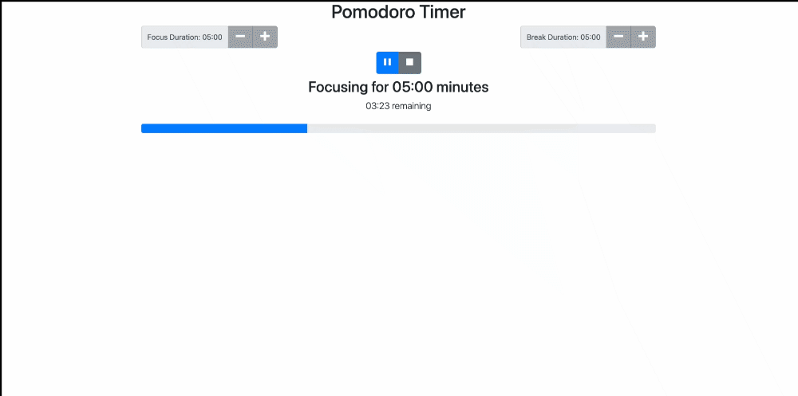
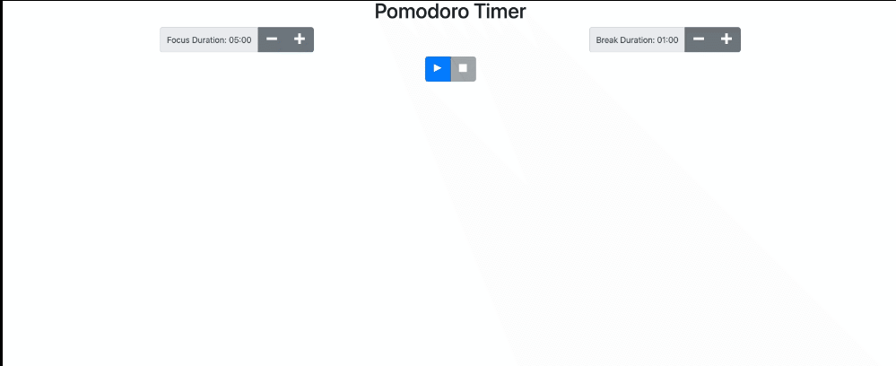
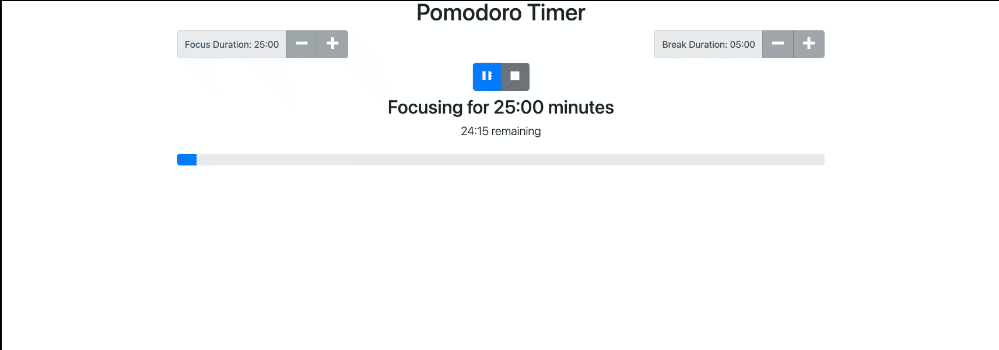
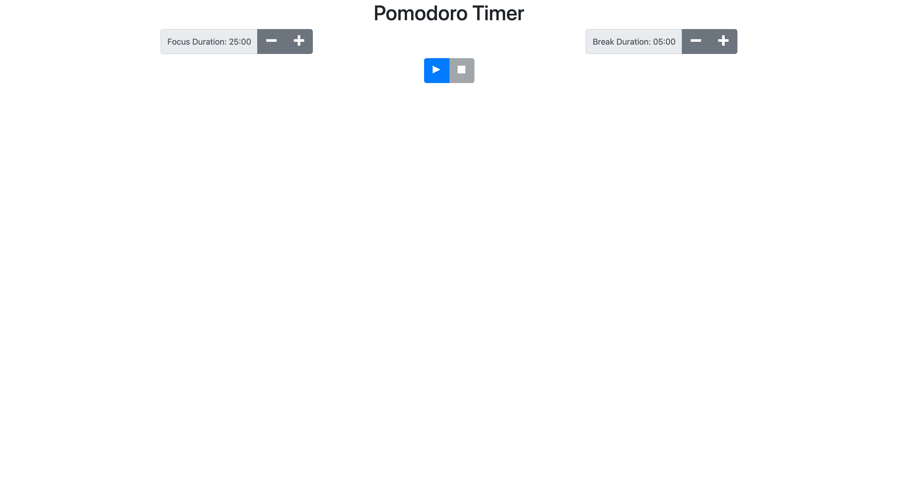
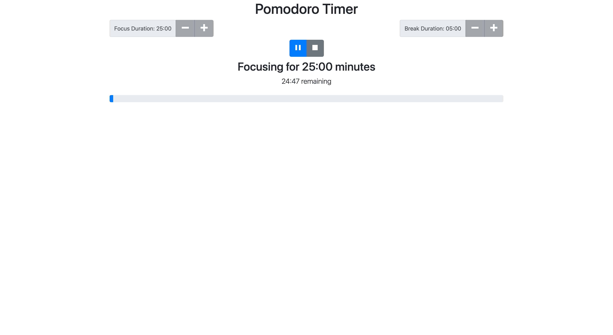
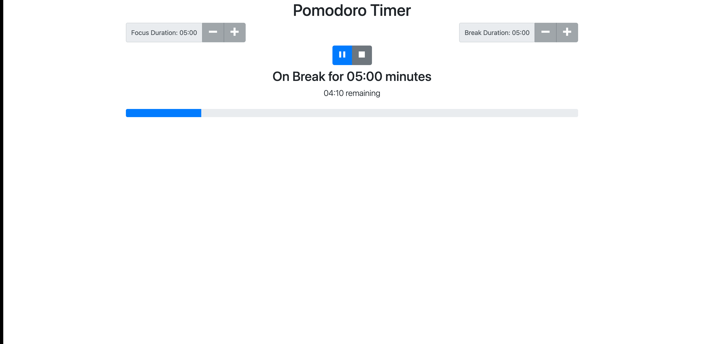
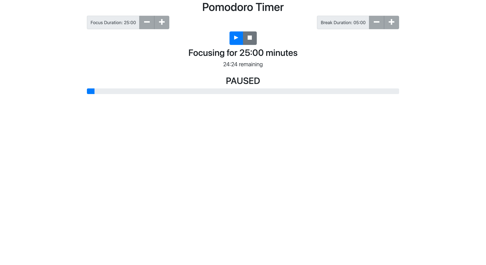

# 🍅 Pomodoro Timer

**⭐ React Project for Thinkful's Software Engineering program ⭐**

**❗ Project Prompt:**

The *Pomodoro Technique* is a time-management method developed by Francesco Cirillo in the late 1980s. The technique uses a timer to break down work into intervals, traditionally 25 minutes in length, separated by short breaks. Each interval is known as a *pomodoro*, from the Italian word for *tomato*, after the tomato-shaped kitchen timer that Cirillo used as a university student. For this project, you will implement a simplified version of Cirillo's original Pomodoro technique.

This project is designed to test your ability to work with rendering and state management using React. Before taking on this project, you should be comfortable with the learning objectives listed below:

- Installing packages via NPM
- Running tests from the command line
- Writing React function components
- Using hooks like ```useState()```
- Debugging React code through console output

You will implement a Pomodoro timer that follows these steps (simplified from the original technique):

- Set the focus duration (default to 25 minutes, no less than 5 or more than 60).
- Set the break duration (default to 5 minutes, no less than 1 or more than 15).
- When the user clicks the ```Play``` button, the timer starts.
- When the focus time expires, an alarm plays and then the break timer starts.
- When the break time expires, the alarm plays again and then the focus timer starts.

Additional Instructions:
- Break up the code into at least two additional components that have a single responsibility.
- The user cannot change the duration of the focus or break during a focus or break session.
- Display durations as ```mm:ss```. That is, ```05:00``` for 5 minutes or ```18:45``` for eighteen minutes and forty-five seconds.
- This application should use [Bootstrap 4](https://getbootstrap.com/docs/4.0/getting-started/introduction/) for styling and [Open-Iconic icons](https://useiconic.com/open) for icons.

### 🍅 Initial Screen 
- The initial screen lets the user set the length of the focus and break and break sessions.

- The ```Stop``` button is disabled on the initial screen because the user has not yet started the timer.
- When the user clicks the ```Play``` button, the timer will always start a new focus session.

### 🍅 Active Session Screen
- After the user clicks the ```Play``` button, the buttons to change the focus and break duration are disabled, and the session timer appears.

- The session timer shows the type of session, either "Focusing" or "On Break", the total duration of the session, the time remaining, and a progress bar showing how much of the session is complete.

### 🍅 Paused Session Screen
- If the user clicks the ```Pause``` button, "paused" appears below the time remaining and the ```Pause``` button becomes ```Play``` button.

- The session timer shows the type of session, either "Focusing" or "On Break", the total duration of the session, the time remaining, and a progress bar showing how much of the session is complete.

### 🍅 Stopping a Session
- Stopping a session returns the application to the initial screen and the user is able to change the focus and break duration.
- Clicking the ```Play``` button will always start a new focus session.


## ⭐️ Demo
### ⭐️ [Click here for live demo](http://pomodoro-timer-nikki-mac.vercel.app) ⭐️

### 🍅 Focusing


### 🍅 Adjust Focus and Break Time


### 🍅 Play, Pause, and Stop Timer



## 💻 Tech Stack
- React
- React Hooks
- JavaScript
- HTML
- CSS


## 📸 Screenshots

### 🍅 Initial Screen


### 🍅 Play Screen: Focusing


### 🍅 Play Screen: Break


### 🍅 Paused Screen


## 🖥 Run Locally

Clone the project

```bash
  git clone https://link-to-project
```

Go to the project directory

```bash
  cd my-project
```

Install dependencies

```bash
  npm install
```

Start the server

```bash
  npm run start
```


## 📈 Running Tests

To run tests, run the following command

```bash
  npm run test
```


## 📓 Project Requirements and Acceptance Criteria

### 🍅 Project rubric
For your project to pass, all of the following statements must be true:

- All tests are passing.
- All props are treated as read-only.
- Audio plays when the focus timer expires.
- Audio plays when the break timer expires.
- All state is updated using callbacks to avoid race conditions. Allowable exceptions are cases where the next state is not determined by the current state. For example, when disabling the timer, it is okay to just call ```setIsTimerRunning(false)```.
- There are at least three components.
- Each component has a single responsibility.
- The main Pomodoro is free of any conditional display logic. This means that there aren't any if statements in the render function; each component determines its own visibility.
